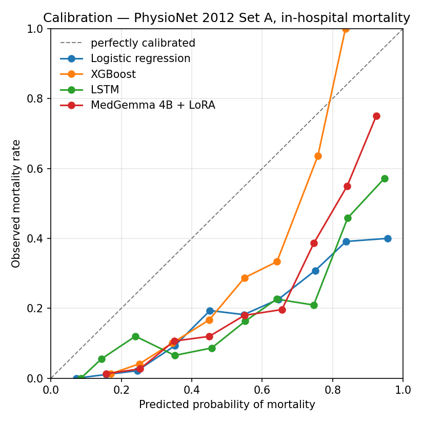

# clinical-llm

> Fine-tuning open LLMs on clinical sequences for outcome prediction. Public ICU benchmarks, honest baselines, and interpretability.

[](https://github.com/z-awan-lab/clinical-llm/actions/workflows/tests.yml)
[](https://www.python.org/downloads/)
[](https://opensource.org/licenses/MIT)
[](https://github.com/psf/black)

An open-source pipeline for fine-tuning small open-weight language models on
longitudinal electronic health record (EHR) data, benchmarked on in-hospital
mortality prediction from the first 48 hours of ICU stay.

## Motivation

Large language models have shown promise for clinical prediction tasks, but most published work depends on private models, private data, or both. This repository provides a fully reproducible, open-stack alternative:

- **Open models** — MedGemma 4B (medical-pretrained Gemma family) via Hugging Face, with LoRA parameter-efficient fine-tuning. The model identifier is configurable, so general-purpose alternatives such as Llama-3.2-3B can be swapped in.
- **Open data** — Primary benchmarks run on the [PhysioNet/CinC Challenge 2012](https://physionet.org/content/challenge-2012/) dataset (~4,000 publicly labelled ICU patients from Set A, no credentialing required). MIMIC-IV is supported as an optional external validation cohort. A synthetic data generator is also included so the pipeline runs end-to-end with neither.
- **Open evaluation** — patient-level splits, bootstrap 95% confidence intervals on AUROC / AUPRC / Brier, calibration analysis
- **Honest baselines** — logistic regression, XGBoost, and LSTM, so the LLM has to earn its complexity

## Results

Benchmarks below are evaluated on the held-out test split (15% of patients,
n = 600) of **PhysioNet/CinC Challenge 2012 Set A** (approximately 4,000
ICU patients with publicly released outcome labels — Sets B and C were
withheld by PhysioNet for evaluation purposes). Point estimates are
followed by 95% bootstrap confidence intervals (1,000 resamples, seed 42).
Brier ↓ and ECE ↓ mean lower is better.

| Model                          | AUROC                   | AUPRC                   | Brier ↓                 | ECE (10-bin) ↓ |
| ------------------------------ | ----------------------- | ----------------------- | ----------------------- | -------------- |
| Logistic Regression            | 0.770 (0.722–0.817)     | 0.330 (0.254–0.432)     | 0.199 (0.185–0.215)     | 0.286          |
| XGBoost                        | **0.782** (0.724–0.830) | **0.424** (0.332–0.528) | **0.157** (0.147–0.166) | **0.234**      |
| LSTM (raw sequences)           | 0.719 (0.653–0.776)     | 0.322 (0.243–0.447)     | 0.213 (0.197–0.227)     | 0.286          |
| MedGemma 4B + LoRA             | 0.777 (0.721–0.828)     | 0.410 (0.311–0.519)     | 0.190 (0.177–0.202)     | 0.286          |



### Observations

**XGBoost leads across every metric.** A well-tuned gradient-boosted tree
on aggregated clinical features wins on discrimination (AUROC, AUPRC),
sharpness (Brier), *and* calibration (ECE). This is the textbook outcome
for tabular clinical data at modest cohort sizes, and matches the
published pattern in PhysioNet 2012 and similar ICU benchmarks.

**MedGemma 4B + LoRA is competitive on discrimination but not the leader.**
Test AUROC 0.777 vs XGBoost's 0.782 is statistically indistinguishable
given the bootstrap CIs, and its AUPRC (0.410) is the second-best of the
four. The LLM also halved the Brier gap to XGBoost compared with an
earlier shorter run, suggesting it benefits from full training rather
than under-training. **It still does not beat XGBoost on this cohort
size**, which is itself a useful finding — a 4B domain-pretrained LLM
with parameter-efficient fine-tuning matches but does not outperform a
strong tree baseline on ~3,000 training patients with sparse features.

**The LSTM underperforms simpler tabular baselines.** With limited
training data and sparse measurements, the sequence model has more
parameters to fit than the signal supports. AUROC 0.719 trails both
logistic regression (0.770) and XGBoost (0.782). This is consistent with
prior published comparisons on PhysioNet 2012 — sequence models tend not
to repay their architectural overhead at this scale.

**Calibration is uniformly poor across three of four models.** ECE
clusters at ~0.286 for logreg, LSTM, and MedGemma, while XGBoost achieves
0.234. The clustering at 0.286 is partly an artefact of small test size
(n = 600 with 14% mortality leaves few patients per probability bin), but
it also signals that none of these models produces well-calibrated
probabilities out of the box. **The natural next step is post-hoc
calibration** (Platt scaling or isotonic regression fitted on the
validation set) — a recognised, principled fix that closes calibration
gaps without affecting ranking.

**Headline finding.** On PhysioNet 2012 Set A, XGBoost is the
strongest baseline by every metric. A medical-domain 4B LLM with LoRA
matches it on discrimination but not calibration. The right engineering
priority for a clinical deployment is post-hoc calibration of the
probability outputs, not architectural complexity.

MIMIC-IV is supported as an optional external validation cohort for users
with credentialed access.

Full per-model reliability diagrams and reproducibility commands are in
[`docs/results.md`](docs/results.md).

## Quick start

```bash
# Clone and install
git clone https://github.com/z-awan-lab/clinical-llm.git
cd clinical-llm
pip install -e ".[dev]"

# OPTION 1 — quick start on synthetic data (no downloads needed)
python -m clinical_llm.data.synthetic_generator --n-patients 2000
python -m clinical_llm.training.train --model logreg --data-dir data/synthetic
python -m clinical_llm.training.train --model xgboost --data-dir data/synthetic
python -m clinical_llm.training.train --model lstm --data-dir data/synthetic

# OPTION 2 — real ICU data (PhysioNet 2012, publicly downloadable)
python -m clinical_llm.data.physionet2012_downloader
python -m clinical_llm.data.physionet2012_loader
python -m clinical_llm.training.train --model logreg --data-dir data/physionet2012
python -m clinical_llm.training.train --model xgboost --data-dir data/physionet2012
python -m clinical_llm.training.train --model lstm --data-dir data/physionet2012

# MedGemma 4B + LoRA (requires GPU and Hugging Face gated access)
pip install -e ".[llm]"
huggingface-cli login   # accept Gemma terms at https://huggingface.co/google/medgemma-4b-it
python -m clinical_llm.training.train --model llm --data-dir data/physionet2012
```

See [`docs/getting_started.md`](docs/getting_started.md) for the full walkthrough, including the optional MIMIC-IV external validation path.

## Project structure

```
clinical-llm/
├── src/clinical_llm/
│   ├── data/              # Loaders, tokenisation, train/val/test splits
│   ├── models/            # Baselines + LoRA fine-tuning
│   ├── training/          # Training loops and configs
│   ├── evaluation/        # Metrics, calibration, bootstrap CIs
│   └── interpretability/  # SHAP and attention visualisation
├── configs/               # YAML configs for each experiment
├── notebooks/             # Exploration and results visualisation
├── tests/                 # pytest unit tests
├── app/                   # Streamlit demo
└── docs/                  # Design decisions and results
```

## Task definition

**In-hospital mortality prediction** from the first 48 hours of ICU stay.
This is a canonical clinical ML benchmark; the prediction setup follows
the convention used in [Harutyunyan et al., 2019](https://www.nature.com/articles/s41597-019-0103-9),
allowing results to be compared with the broader literature on MIMIC,
PhysioNet 2012, and eICU benchmarks.

## Reproducibility

- All experiments are deterministic given a fixed seed (`--seed 42` by default).
- Pinned dependencies in `pyproject.toml`.
- Dockerfile included for environment isolation.
- CI runs the full test suite on every push.

## Citation

If this repository is useful for your research, please cite:

```bibtex
@software{awan2026clinicalllm,
  author = {Awan, Zainab},
  title  = {clinical-llm: Fine-tuning open LLMs on clinical sequences},
  year   = {2026},
  url    = {https://github.com/z-awan-lab/clinical-llm}
}
```

## License

MIT — see [LICENSE](LICENSE).

## Acknowledgements

Built on the shoulders of the [PhysioNet/CinC Challenge 2012](https://physionet.org/content/challenge-2012/) (Silva et al., 2012), [MIMIC-IV](https://physionet.org/content/mimiciv/), [Hugging Face Transformers](https://github.com/huggingface/transformers), and the [PEFT](https://github.com/huggingface/peft) library.
